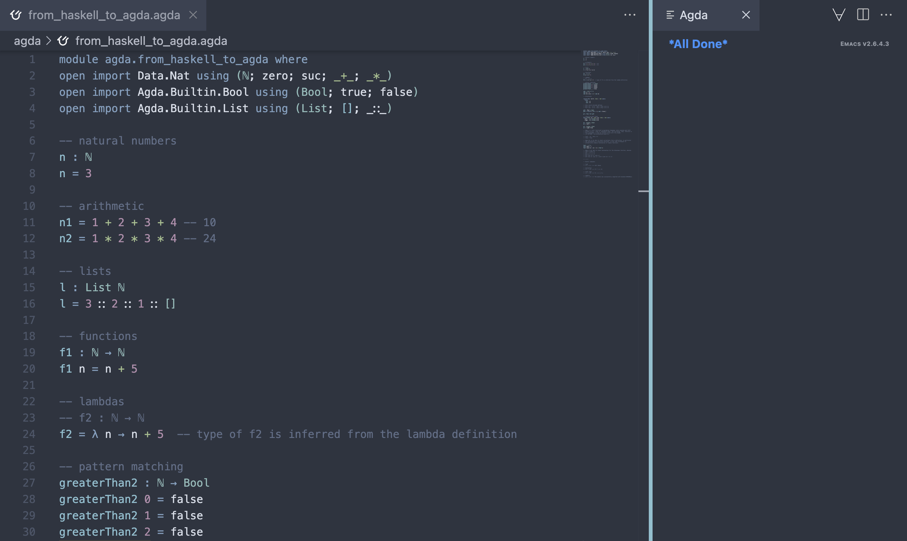

# Agda Instalation

Follow the instructions in [the Agda documentation](https://agda.readthedocs.io/en/latest/getting-started/installation.html). It offers several options for common operating systems.

Emacs has great support for Agda. If working with VSCode, install the [Agda-Mode](https://marketplace.visualstudio.com/items?itemName=banacorn.agda-mode) extension.  

After installing everything, open [from_haskell_to_agda.agda](./from_haskell_to_agda.agda). Executing the commands `ctrl-c + ctrl-l` (loading) should open the Agda dialog like in the following picture:

You may also use Agda online at [agdapad.quasicoherent.io](https://agdapad.quasicoherent.io/). 