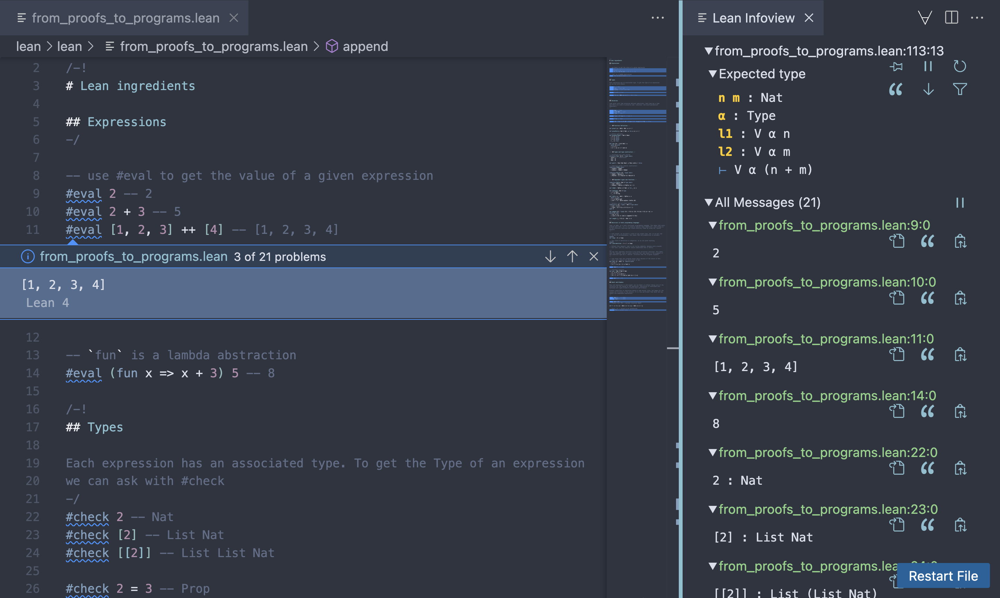

# Lean Installation

Lean 4 installation instructions can be found [here](https://leanprover-community.github.io/get_started.html).

We will use VS Code as our IDE, so it is necessary to install the [Lean 4](https://marketplace.visualstudio.com/items?itemName=leanprover.lean4) extension. 

Once everything is installed, open [from_proofs_to_programs.lean](lean/from_proofs_to_programs.lean) and press `Ctrl + Shift + P` to open the `Lean Infoview` terminal. You should get something similar to the image:  

(alternatively, Lean 4 extension adds a "∀" button in the right top corner with the `Lean Infoview` and other useful resources).

You may also use Lean online at [live.lean-lang.org](https://live.lean-lang.org/). 
